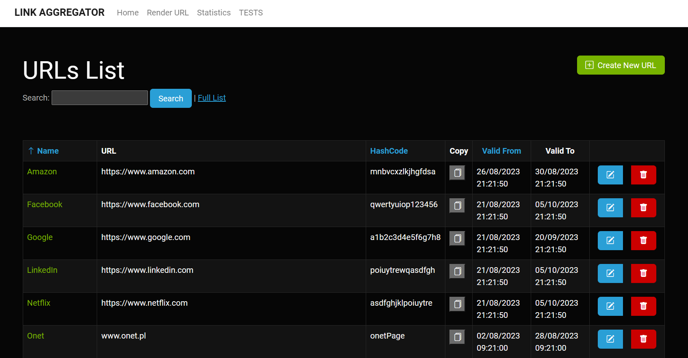

# LinkAggregationApp

<!DOCTYPE html>
<html>
<head>
  <title>LinkAggregator - Aplikacja webowa do zarządzania hiperłączami</title>
</head>
<body>

<h1>LinkAggregator - Aplikacja webowa do zarządzania hiperłączami</h1>

LinkAggregator to aplikacja webowa napisana w technologii Razor Pages, która umożliwia użytkownikom zarządzanie hiperłączami, generowanie spersonalizowanych adresów URL, pobieranie danych o lokalizacji użytkowników na podstawie ich adresu IP, wyświetlanie tych danych na wykresach oraz w formie listy. Projekt jest oparty na technologiach takich jak Entity Framework Core, Bootstrap 5, Chart.js, Toastr i IpInfo, a także wykorzystuje walidację modelu dla bezpieczeństwa i dokładności danych.

<h2>Funkcje</h2>

<h3>Dodawanie, usuwanie, edytowanie hiperłącz</h3>

Aplikacja umożliwia użytkownikom dodawanie nowych hiperłącz oraz usuwanie lub edytowanie istniejących. Dzięki temu użytkownicy mogą łatwo zarządzać swoimi ulubionymi linkami.

<h3>Generowanie spersonalizowanych adresów URL</h3>

LinkAggregator pozwala użytkownikom generować spersonalizowane adresy URL dla swoich hiperłącz. Dzięki temu można łatwo udostępniać linki o czytelnych i zapadających adresach.

<h3>Pobieranie danych o lokalizacji użytkownika</h3>

Aplikacja wykorzystuje adres IP użytkownika do pobierania informacji o jego lokalizacji. To przydatne narzędzie, które może pomóc w analizie, gdzie znajdują się odwiedzający stronę.

<h3>Wyświetlanie danych na wykresach</h3>

Dane o lokalizacji użytkowników są prezentowane na wykresach, co umożliwia wizualizację i analizę tych informacji. Wykresy są generowane za pomocą biblioteki Chart.js, co pozwala na atrakcyjne i interaktywne wykresy.

<h3>Prezentacja danych w postaci listy</h3>

Oprócz wykresów, aplikacja wyświetla dane o lokalizacji użytkowników w formie listy. Dzięki temu użytkownicy mogą szybko przeglądać te informacje.

<h2>Technologie</h2>

Projekt LinkAggregator wykorzystuje wiele popularnych technologii, w tym:

<ul>
  <li><strong>Razor Pages:</strong> Technologia do tworzenia dynamicznych stron internetowych w .NET, która ułatwia tworzenie interaktywnych interfejsów użytkownika.</li>
  <li><strong>Entity Framework Core:</strong> Biblioteka do obsługi bazy danych, która umożliwia łatwe zarządzanie danymi.</li>
  <li><strong>Bootstrap 5:</strong> Framework do tworzenia responsywnych i atrakcyjnych stron internetowych.</li>
  <li><strong>Chart.js:</strong> Biblioteka do tworzenia dynamicznych wykresów i grafik.</li>
  <li><strong>Toastr:</strong> Biblioteka do wyświetlania komunikatów i powiadomień dla użytkowników.</li>
  <li><strong>IpInfo:</strong> Usługa do pobierania danych o lokalizacji użytkowników na podstawie adresu IP.</li>
</ul>

<h2>Walidacja modelu</h2>

Aplikacja LinkAggregator korzysta z walidacji modelu, co oznacza, że dane wprowadzane przez użytkowników są sprawdzane pod kątem poprawności i zgodności z określonymi regułami. To zapewnia bezpieczeństwo i dokładność danych w systemie.

<h2>Wymagania systemowe</h2>

Aby uruchomić aplikację LinkAggregator, potrzebujesz:

<ul>
  <li>.NET Core SDK (wymagana wersja X.X.X)</li>
  <li>Visual Studio lub inny edytor kodu</li>
  <li>Przeglądarka internetowa</li>
</ul>

<h2>Instalacja i uruchomienie</h2>

Aby zainstalować i uruchomić aplikację LinkAggregator, wykonaj następujące kroki:

<ol>
  <li>Sklonuj repozytorium na swój lokalny komputer.</li>
  <li>Otwórz projekt w swoim edytorze kodu.</li>
  <li>Uruchom aplikację przy użyciu .NET Core SDK.</li>
  <li>Otwórz przeglądarkę internetową i przejdź do <a href="http://localhost:5000">http://localhost:5000</a>.</li>
</ol>

<h2>Autor</h2>

Ten projekt został stworzony przez [Twoje Imię i Nazwisko]. Kontakt do autora: [adres e-mail autora].

<h2>Licencja</h2>

Ten projekt jest dostępny na licencji [nazwa licencji]. Szczegóły licencji można znaleźć w pliku [LICENSE.md].

To jest ogólny opis projektu LinkAggregator. Możesz dostosować go do swoich potrzeb, dodając więcej szczegółów, dokumentacji oraz instrukcji instalacji i korzystania z aplikacji.

</body>
</html>
