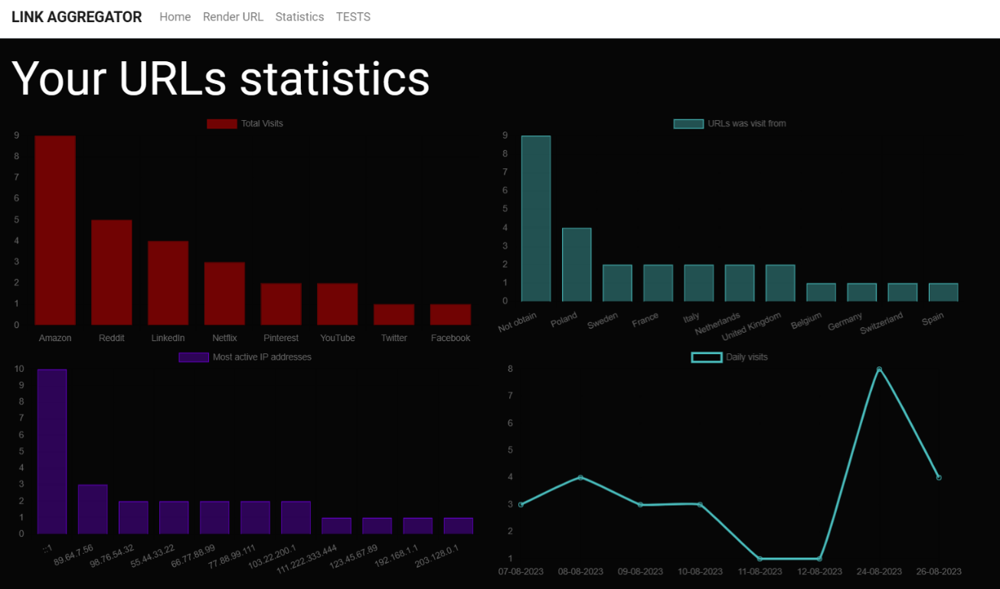

# LinkAggregationApp

<!DOCTYPE html>
<html>
<head>
</head>
<body>

<h1>LinkAggregator - Aplikacja webowa do zarządzania hiperłączami</h1>

LinkAggregator to aplikacja webowa napisana w technologii Razor Pages, która umożliwia użytkownikom zarządzanie hiperłączami, generowanie spersonalizowanych adresów URL, pobieranie danych o lokalizacji użytkowników na podstawie ich adresu IP, wyświetlanie tych danych na wykresach oraz w formie listy. Projekt jest oparty na technologiach takich jak Entity Framework Core, Bootstrap 5, Chart.js, Toastr i IpInfo, a także wykorzystuje walidację modelu dla bezpieczeństwa i dokładności danych. Aplikacja została udostępniona na chmurze Azure.

<h2>Funkcjonalności</h2>

<h3>Dodawanie, usuwanie, edytowanie hiperłącz</h3>

Aplikacja umożliwia użytkownikom dodawanie nowych hiperłącz oraz usuwanie lub edytowanie istniejących. Dzięki temu użytkownik jest w stanie łatwo zarządzać swoimi adresami URL.

<h3>Generowanie spersonalizowanych adresów URL</h3>

LinkAggregator pozwala użytkownikom generować spersonalizowane adresy URL dla swoich hiperłącz. Odbywa się to podczas dodawania nowego adresu URL do bazy danych

<h3>Pobieranie danych o lokalizacji użytkownika</h3>

Aplikacja wykorzystuje adres IP użytkownika do pobierania informacji o jego lokalizacji. W tym celu jest wykorzystywana biblioteka IPInfo, wysyła ona żądanie do API gdzie w ciele jest przekazywany adres IP pobrany z nagłówka zapytania HTTP

<h3>Wyświetlanie danych na wykresach</h3>

Dane o lokalizacji użytkowników są prezentowane na wykresach, co umożliwia wizualizację i analizę tych informacji. Wykresy są generowane za pomocą biblioteki Chart.js, co pozwala na atrakcyjne i interaktywne wykresy.

<h3>Prezentacja danych w postaci listy</h3>

Oprócz wykresów, aplikacja wyświetla dane o aktywnościach użytkowników w formie listy. Dzięki temu użytkownik może szybko przeglądać jaki ruch wygenerowały jego zasoby

<h2>Technologie</h2>

Projekt LinkAggregator wykorzystuje wiele popularnych technologii, w tym:

<ul>
  <li><strong>Razor Pages:</strong> Technologia do tworzenia dynamicznych stron internetowych w .NET, która ułatwia tworzenie interaktywnych interfejsów użytkownika.</li>
  <li><strong>Entity Framework Core:</strong> Biblioteka do obsługi bazy danych, która umożliwia łatwe zarządzanie danymi.</li>
  <li><strong>Bootstrap 5:</strong> Framework do tworzenia responsywnych i atrakcyjnych stron internetowych.</li>
  <li><strong>Chart.js:</strong> Biblioteka do tworzenia dynamicznych wykresów i grafik.</li>
  <li><strong>Toastr:</strong> Biblioteka do wyświetlania komunikatów i powiadomień dla użytkowników.</li>
  <li><strong>IpInfo:</strong> Usługa do pobierania danych o lokalizacji użytkowników na podstawie adresu IP.</li>
</ul>

<h2>Walidacja modelu</h2>

Aplikacja LinkAggregator korzysta z walidacji modelu, co oznacza, że dane wprowadzane przez użytkowników są sprawdzane pod kątem poprawności i zgodności z określonymi regułami. To zapewnia bezpieczeństwo i dokładność danych w systemie. odbywa sie to poprzez nakładanie atrybutów na encje bazy danych oraz poprzez sprawdzanie wypełnienia danych pól

<h2>Uruchomienie aplikacji </h2>

Z aplikacji można korzystać lokalnie za pomocą kodu zawartego w repozytorium (wymagania systemowe i kolejne kroki uruchomienia poniżej) lub pod podanym adresem na chmurze Azure:  

<a href="https://linkaggregator.azurewebsites.net/">linkaggregator.com </a>.

hasło do serwisu to <b>pass2345#</b>

<h2>Aplikacja na lokalnej maszynie i wymagania systemowe</h2>

Aby uruchomić aplikację LinkAggregator na lokalnym urządzeniu, potrzebne s a:

<ul>
  <li>.NET Core SDK (min. 6.0)</li>
  <li>Visual Studio lub inny edytor kodu</li>
  <li>Przeglądarka internetowa</li>
  <li>MS SQL Server RDBMS</li>
</ul>

<h2>Instalacja i uruchomienie</h2>

Aby zainstalować i uruchomić aplikację LinkAggregator, wykonaj następujące kroki:

<ol>
  <li>Sklonuj repozytorium na swój lokalny komputer.</li>
  <li>Otwórz projekt w swoim edytorze kodu.</li>
  <li>Utwórz bazę danych MS SQL Server, po czym dodaj Connection String do pliku appsettings.json</li>
  <li>Uruchom aplikacje, zostanie otwarta przeglądarka internetowa z adresem <b>https://localhost:7282/</b>.</li>
  <li>Wpisz podane wcześniej hasło.</li>
</ol>

<h2>Autor</h2>

Ten projekt został stworzony przez Bartosza Surmińskiego.

</body>
</html>
